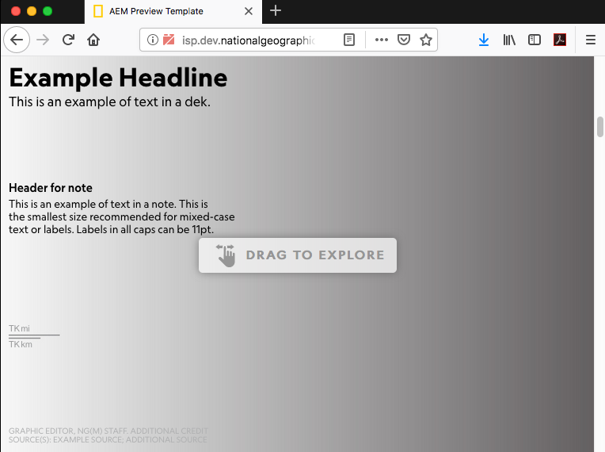

## ngDragWide

Got a wide graphic? Drag to see more!



### Illustrator

Within your `ai2html-settings` block paste the lines below.

```
include_resizer_script: no
include_resizer_css_js: no
use_lazy_loader: no
```

This will disable using multiple artboards within your ai file. If you need breakpoints you will need to handle that manually with media queries.

### HTML
- Copy the contents of `ngDragWide.html`
- Open `src/html/_graphic.html`. Paste it into this div
```
<div id="ng-graphic-wrap">
```

- Cut your ai2html include, i.e.: 
```
{{> ai2html-project-name }}
``` 

- Paste it into this section within `_graphic.html`
```
<!-- STUFF TO DRAG GOES HERE -->
```

### CSS
- Paste this line within `src/sass/base.scss`, below `/* YOUR PROJECT CSS OR SASS HERE */`: 
```
@import '../components/ngDragWide/ngDragWide.scss';
```

### JS
- Paste this line in the top of `src/js/base.js`
```
import ngDragWide from '../components/ngDragWide/ngDragWide.js'
```

- Paste this into the `DOMContentLoaded` section:
```
ngDragWide({
    selector:"#ng-graphic-wrap",
    offsetX: 0
})
```

Make `offsetX` a negative number to start the graphic not at the left


