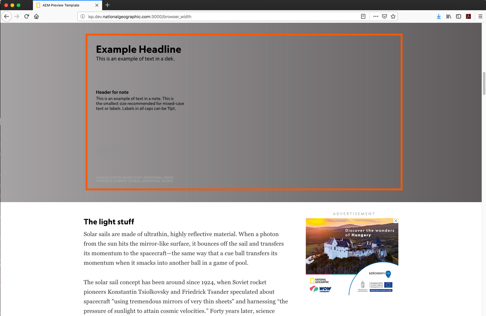

## ngFullBleed

Allow artboard art to be huge and full bleed but keep content centered at a typical width. Use browser_width component to preview this: http://isp.dev.nationalgeographic.com:3000/browser_width



### Illustrator

- Make your artboard huge, but force it to have a `:MIN_WIDTH` that matches your safe area.
  - i.e.: Rename your mega artboard "desktop-medium:1020".
- Your safe area will be the original artboard size, centered within the huge artboard. Make some guides!
- See "Custom Breakpoints" at the [ai2html site](http://ai2html.org/examples.html#custom-breakpoints).

### CSS 

- Paste this within `src/sass/base.scss`, below `/* YOUR PROJECT CSS OR SASS HERE */`
```
@import '../components/ngFullBleed/ngFullBleed.scss';
@include ngFullBleed(
    $selector: #ng-graphic-wrap, 
    $artboard: "desktop-medium"
);
```

Set `$selector` to the ID of the div surrounding your `{{> ai2html}}``
Set `$artboard` to the name of the artboard that should be full bleed.


### HTML

No mods needed

### JS 

No mods needed